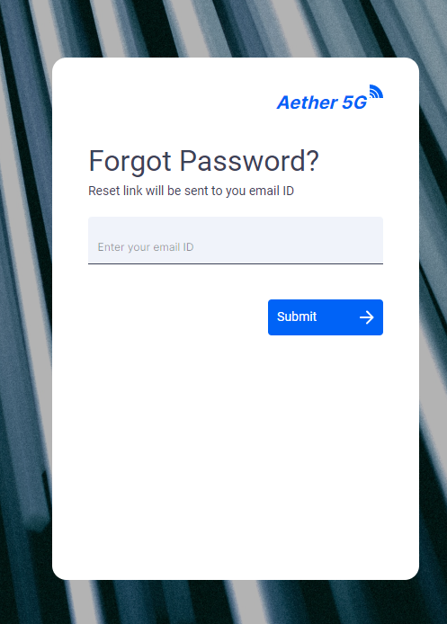

<!--
SPDX-FileCopyrightText: 2020-present Open Networking Foundation <info@opennetworking.org>

SPDX-License-Identifier: Apache-2.0
-->

# Forgot Password Component

Forgot password is for resetting the user password using their Email ID / Username.

- Users can provide their Email ID for resetting their password to the portal to access the application.

## Developer Information

### Implementation

When the **Forgot password** is loaded:

- Users will see the page asking for their Email ID.
- Users need to fill in the details and click on the `Submit` button
- No APIs are integrated for now
