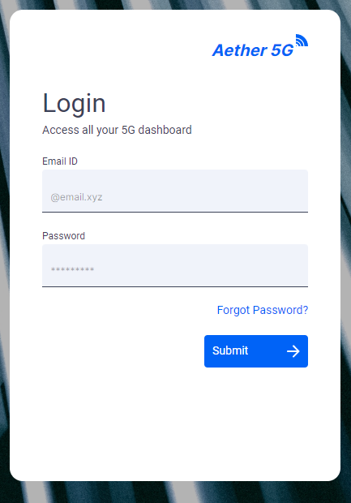

<!--
SPDX-FileCopyrightText: 2020-present Open Networking Foundation <info@opennetworking.org>

SPDX-License-Identifier: Apache-2.0
-->

# Login Component

Login is for authenticating the user credentials to access the application.

- Users can provide their credentials to login to the portal to access the application.

- `Forgot Password?` link available for the user to request for a reset password.

## Developer Information

### Implementation

When the **Login** is loaded:

- Users will see the login page with couple of inputs.
- If users click on the `Submit` button without providing credentials. An error message will be displayed.
- No APIs are integrated for now
