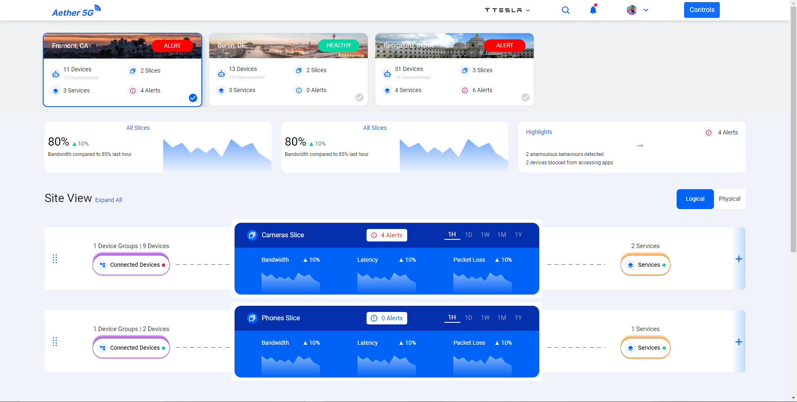
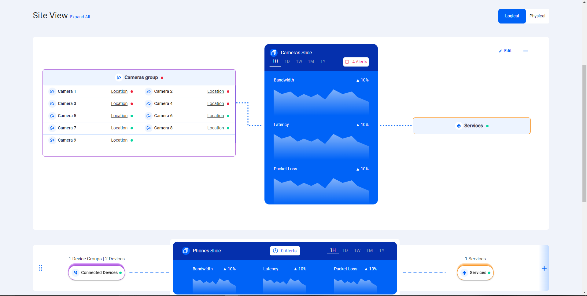
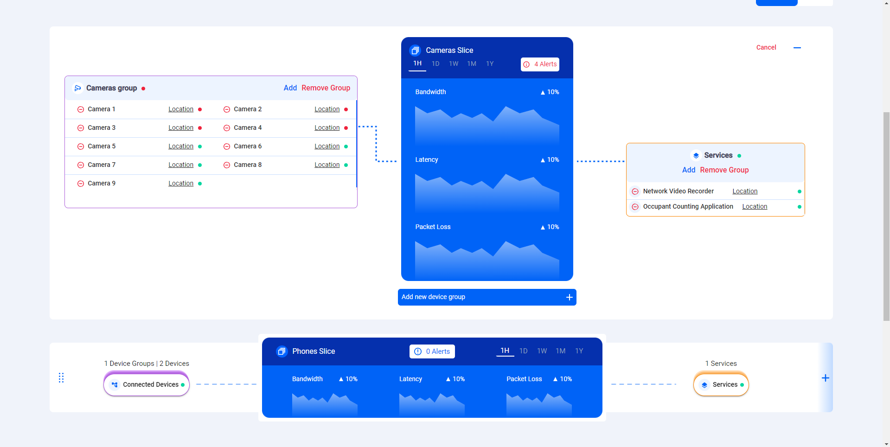
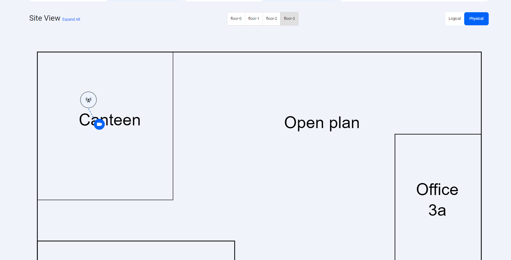
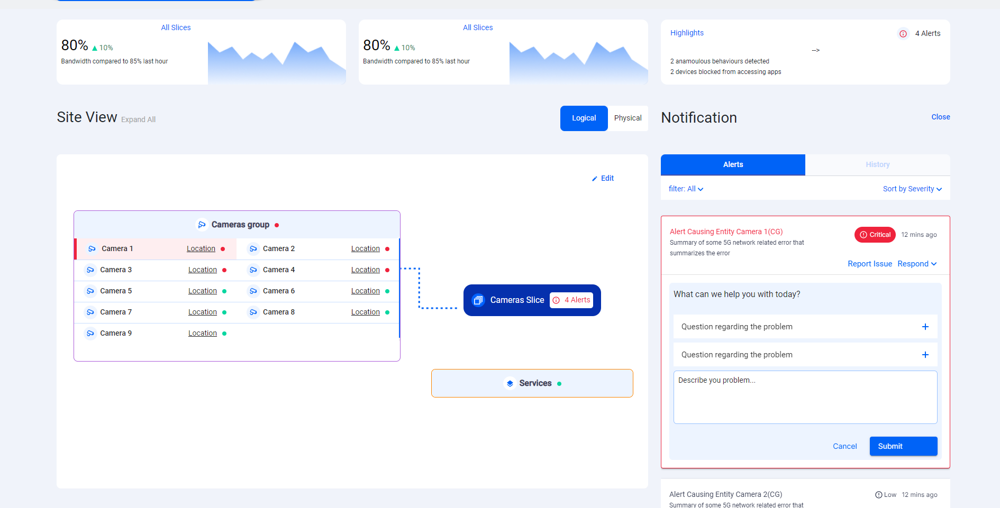
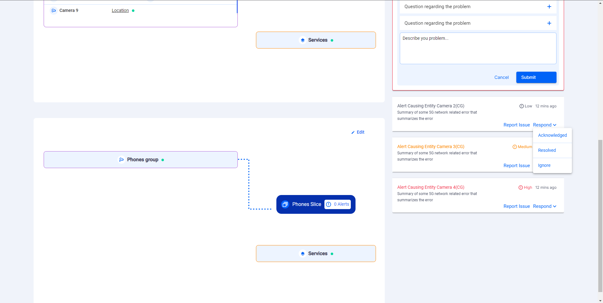
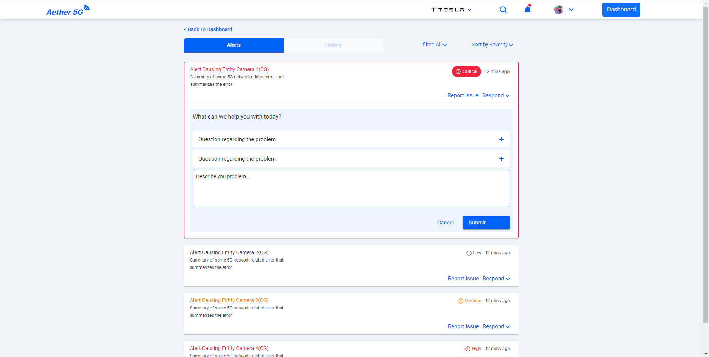

# Dashboard Component

Dashboard is the default landing page for the users after they are able to successfully login.

- `Dashboard` contains lot of sections where users can find minimal required information.
- The top section of the dashboard contains the list of sites with images and some basic information of that particular site.
- Users can switch between sites by clicking on the respective cards and in the bottom the site related information is displayed.
- Immediately after the sites, the bandwidth information of the site is displayed.
- `Highlights` of that particular site are also visible next to the bandwidth information.
- Below the bandwidth the `slices` in the selected site are displayed in the list view.
- Each `Slice` can be expanded using the plus icon to display the detailed view of the slice.

  

- In the expanded view of the `Slice` we can see the device groups and the devices in the respective device group can be viewed.
- In the middle section of the `Slice` we can see the **Latency, Bandwidth and Packet Loss** of the slice.
- Users can also edit the slices. The edit view of the Slice looks as shown below:

  

- In the edit view of the `Slice` users can see the option to add and delete device groups from the `Slice`.
- In addition users can also handle `Services` of the slice.
- In the `Physical view` of the site view users can see the `Small Cell` view as shown below:

  

- The operations on the Small Cell view is similar to the [Small Cells](/src/app/Modules/settings/small-cell/small-cell.component.md) view.
- Users can also look at the alerts in the site using the `Highlights` section in the top of the dashboard screen.
- When user clicks on the alerts an alerts section is opened to the right of the site view as shown below:

  

- When users work on any alert related to a particular device that device highlighted with a red color background.
- Users can mark the alerts with various options that are available as shown below:

  

- Users can also look at all the alerts in their company using the bell icon the header to navigate to the alerts page.
  

## Developer Information

### Implementation

When the **Dashboard** is loaded:

- A function is called to set the current Site.
- A REST-API request is sent as a GET to [https://chronos-dev.onlab.us/chronos-exporter/config](https://chronos-dev.onlab.us/chronos-exporter/config).
- Dashboard is created as an Angular Module.
- All the visual information available in the dashboard are broken into multiple Angular components and are avilable in the pages folder.
- Using **@Input, @Output** and **@ViewChild** parameters from Angular Core are used to pass the information from Dashboard Component to the pages components.
- **parentWillTakeAction** function declared in the Dashboard component is responsible for handling the click functionalities.
- The Slices in the slices component can be drag and drop which will help the user to assign them as per their requirement.
- [Joiner Module](/src/app/Modules/joiner/joiner.component.md) is used in the Small Cells and Slices for connecting the HTML elements with svg lines.
