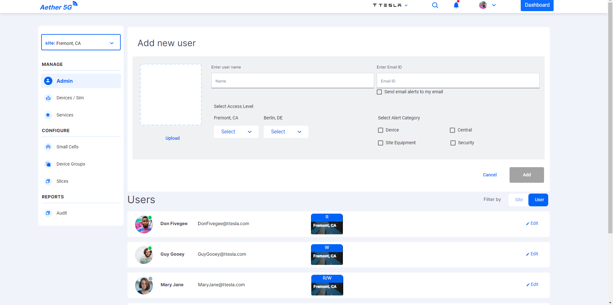
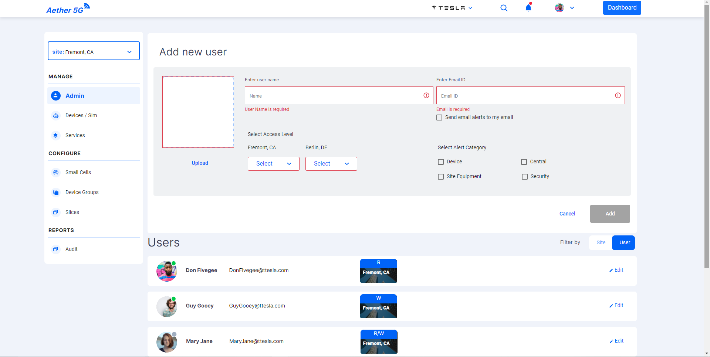
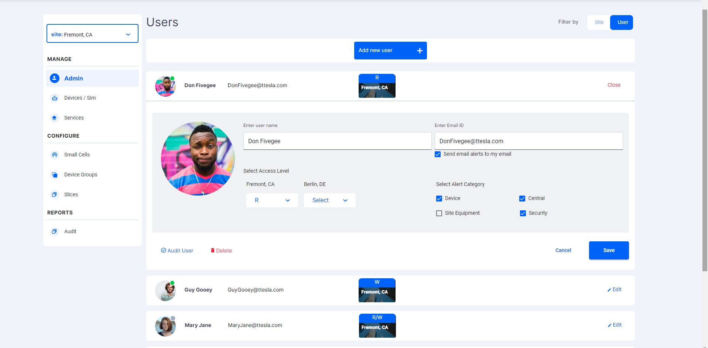
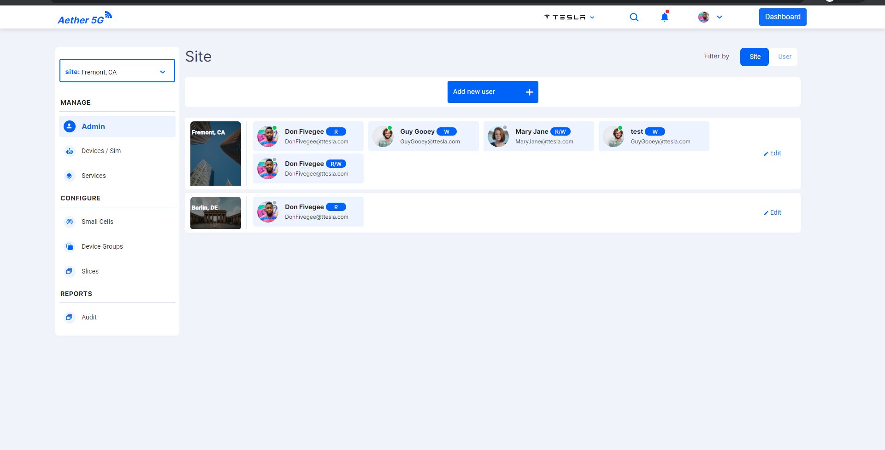
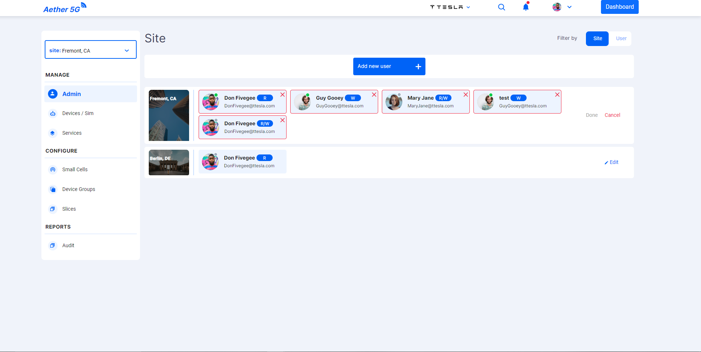

# Admin Component

Admin Component is used to handle the users in the Organization. The default view of the Admin panel is as shown below:

- Admin can add a new user to the Organization using **Add new user** button in top of the screen.
- Once the admin clicks they can see the screen to add the user details.

  

- Admin has to fill the required details and press **Add** button or the required fields will be highlighted as shown below:

  

- The added users details can also be edited.

  

- In edit user screen user has an option to view the audit of the user and also to delete the user. Both of the actions will trigger and open dialogs.
- These dialogs can be viewed in the [`Dialog Components`](/src/app/Modules/settings/dialogs/dialogs.md).

- Admin also has the option to view the users based on the sites using the `filter by site` that is located in the top right of the screen.

  

- Here admin can look at the multiple sites and the users belongs to the site and their permission for the respective site.
- Admin can also edit the sites, using which admin can remove users from the site.

  

## Developer Information

### Implementation

When the **Admin Component** is loaded:

- API is not avialable to fetch the users.
- So it is designed in such a way that a list of users is created in the Users service.
- In this list the users access permissions are also being handled.
- Every user and site edit is handled directly in the service.
- Which maintains accurate data displaying the correct users and sites.
