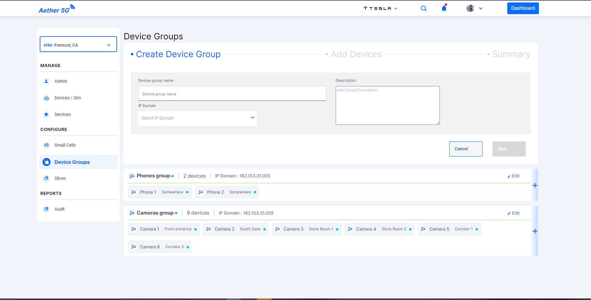
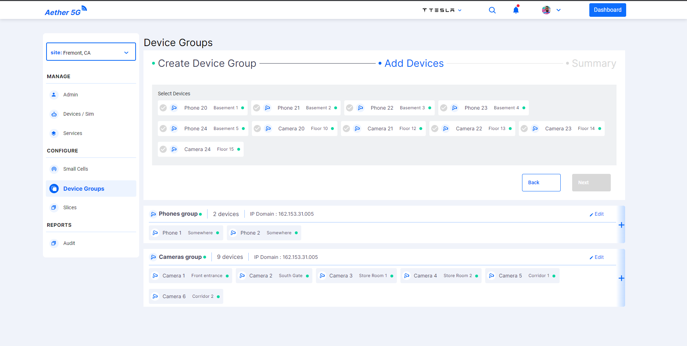
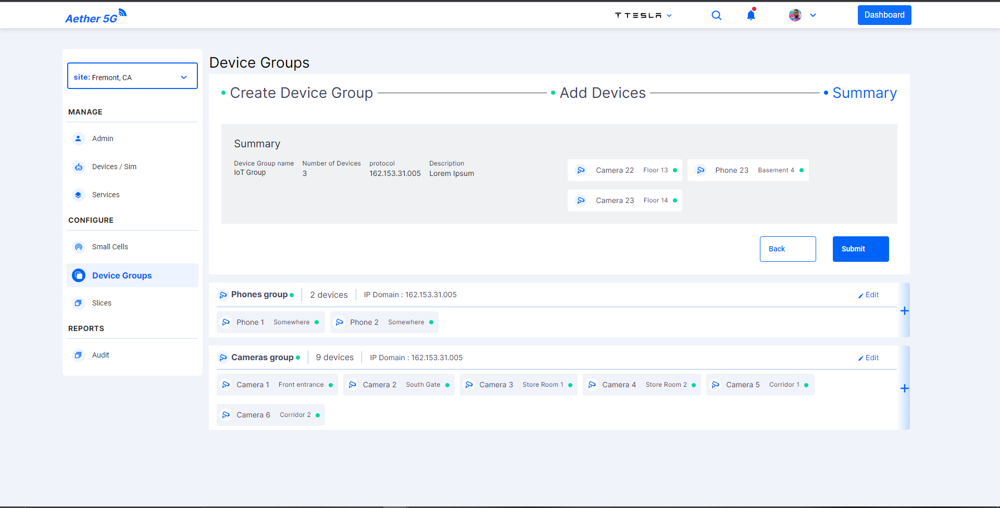
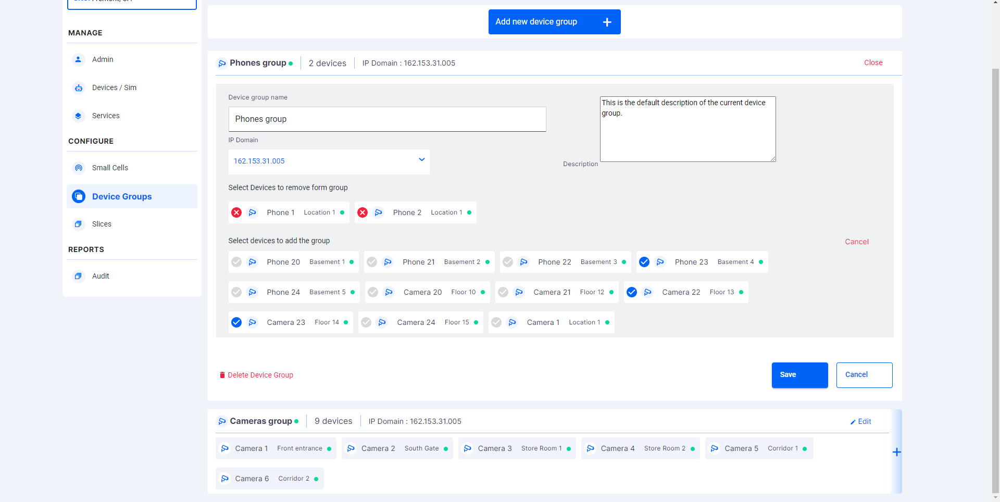

# Device Groups Component

Device Groups Component is used to grouping multiple devices of the organization in a particular site into one.

- User can add a new device groups to the site using **Add new device group** button in top of the screen.
- Once the user clicks they can see the screen to add the service details. Adding a device group is a 3 step process.
- In the first step user will be asked to provide the name of the group.

  

- In the second step user will be provided the list of devices in the site. User can select the devices that they want to add to the group by selecting them.

  

- The third step is the summary of the first two steps displaying the user selected data. Users can always go back with the help of the back button avilable in the bottom of the add section.

  

- The added devices groups details can also be edited.

  

- In edit screen users have the option to select new devices and unselect the existing devices.
- In edit device group screen user has an option to delete the delete device group. The action will trigger and open dialog.
- The dialog can be viewed in the [`Dialog Components`](../dialogs/README.md).

## Developer Information

### Implementation

When the **Device Groups Component** is loaded:

- A function is called to set the current Site.
- A REST-API request is sent as a GET to [https://chronos-dev.onlab.us/chronos-exporter/config](https://chronos-dev.onlab.us/chronos-exporter/config).
- This request returns the info of the device groups available for the site.
- Mat Step is used for the steps in add device group scren.
- As the API is only available for fetching the devie groups.
- The fetched device groups are stored into the array.
- All the CRUD operations that are performed after the initial fetch are handled in the frontend.
- Using Array methods like push, splice etc these CRUD operations are performed.
