# Device/SIM Component

Device SIM Component is used to connect a device with a SIM to access aether network.

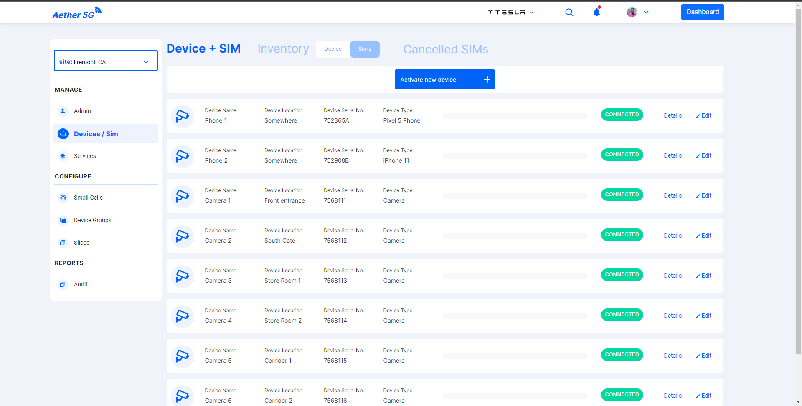

- Device/SIM is divided into three sections.
- **First section** is `Device/SIM` section where list of active devices are displayed.
- User can activate a new device in this section to the site using **Activate new device** button in top of the screen.
- Once the user clicks they can see the screen to activate the device.

  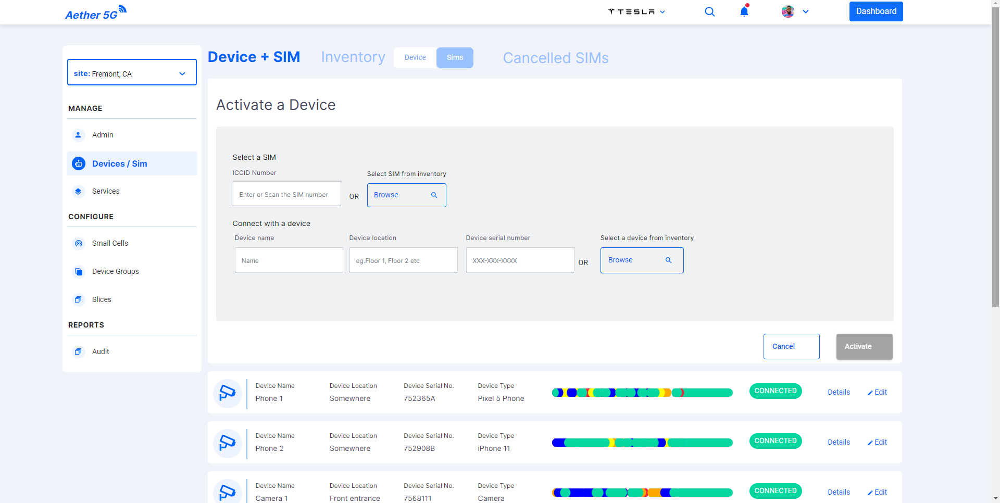

- User can type and fill the data or they can use the options **Seleclt SIM** and **Seleclt Device** to select the options available from the inventory that will fill the data.

  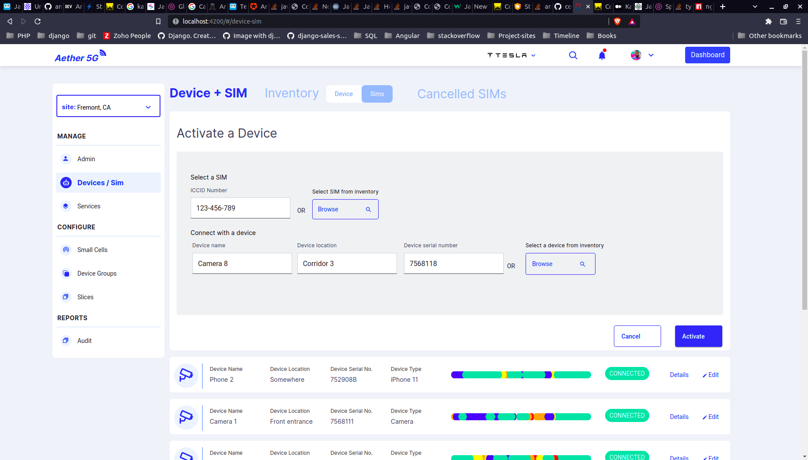

- The dialog screens for selecting the devices and SIMs can be found [here](../dialogs/README.md).
- User has to fill the required details and press **Activate** button or the required fields will be highlighted as shown below:

  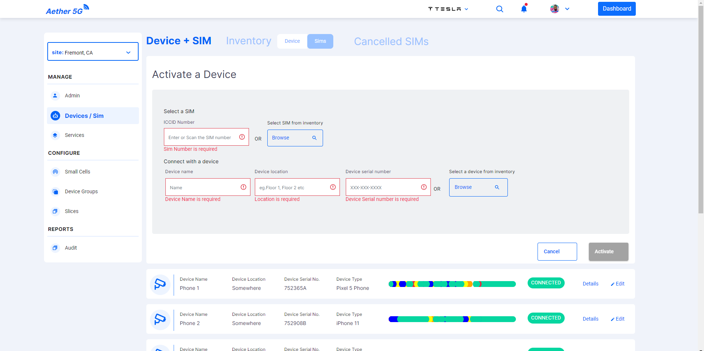

- The activated devices details can also be edited.

  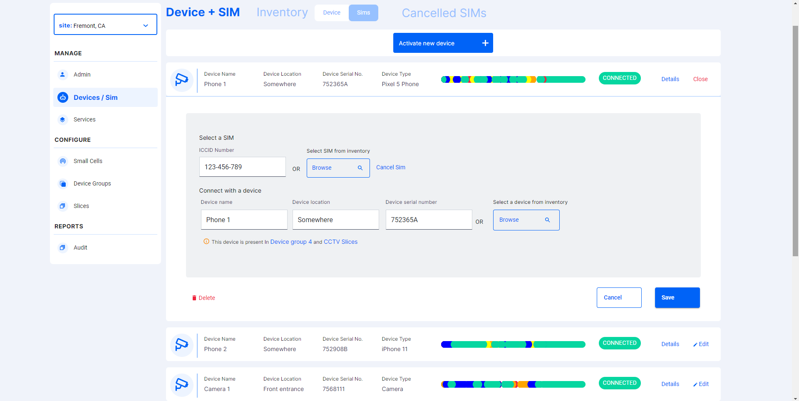

- In edit screen user has an option to delete the device and SIM connection. The action will trigger and open dialog.
- The dialog can be viewed in the [`Dialog Components`](../dialogs/README.md).
- Users can also monitor the activities that are performed the device using the **Details** button available for every activated device.

  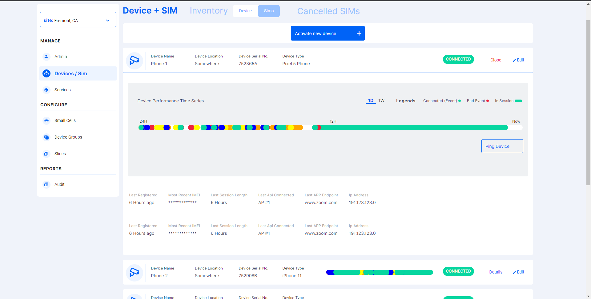

- A week view also available for the details section where user can zoom into any day they select in that week.
- **Second section** is `Inventory` section where list of devices and SIMs that are not activated can be shown.
- Inventory section itself has two sections Device and SIMs.
- In Device section user can manage the devices.
- User can add a new device in this section to the site using **Add new device** button in top of the screen.
- Once the user clicks they can see the screen to add a new device.

  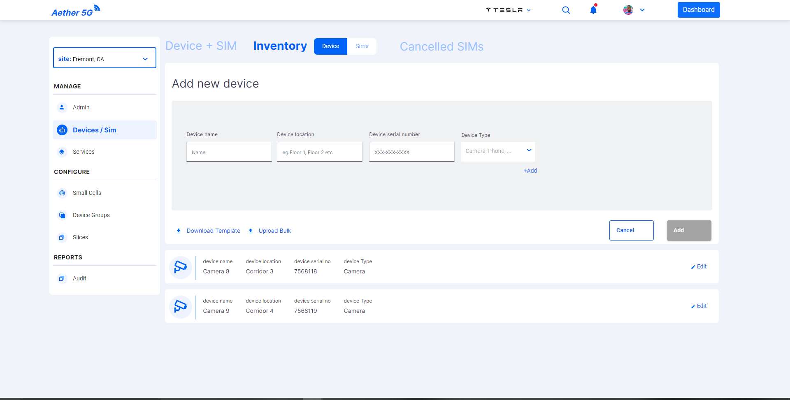

- User has to fill the required details and press **Add** button or the required fields will be highlighted as shown below:

  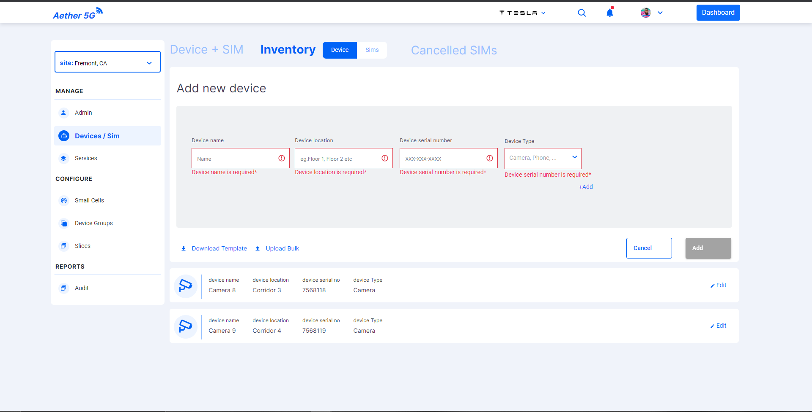

- Available devices details can also be edited.

  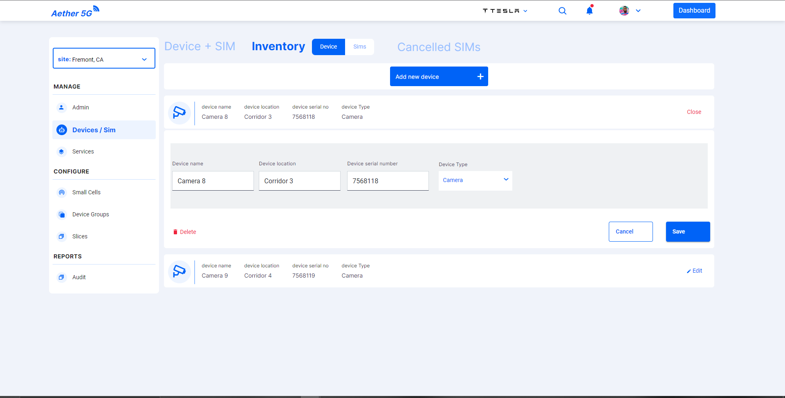

- In edit screen user has an option to delete the device and SIM connection. The action will trigger and open dialog.
- The dialog can be viewed in the [`Dialog Components`](../dialogs/README.md).
- SIMs section in the inventory displays the SIMs that are inactive.

  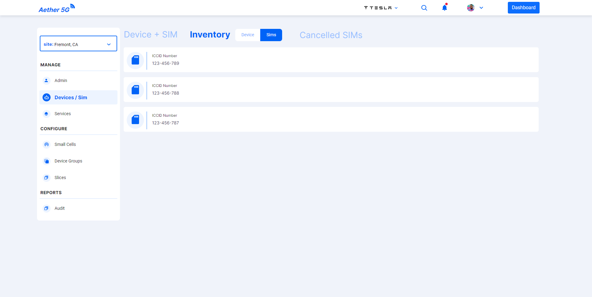

- **Third Section** is the `Cancelled SIMs` in which all the cancelled SIMs are displayed

  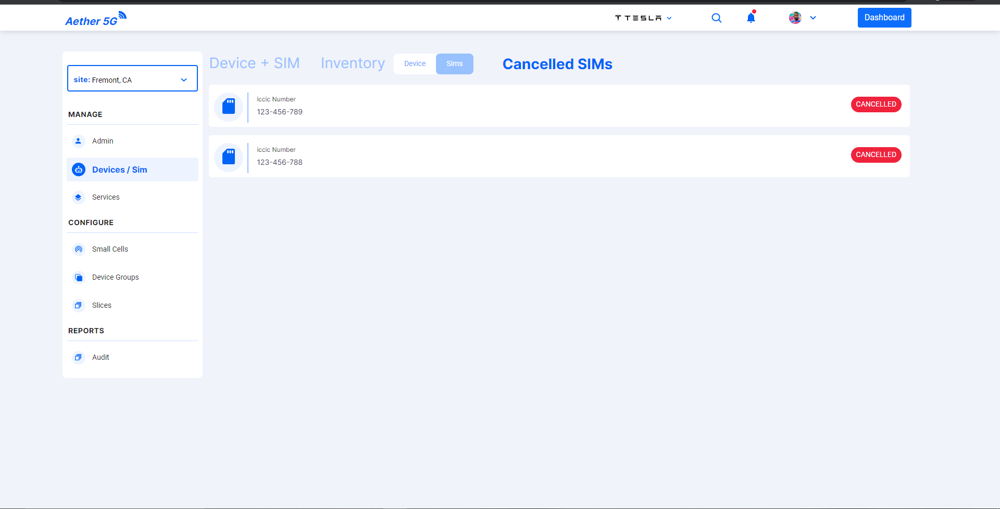

## Developer Information

### Implementation

When the **Device/SIM Component** is loaded:

- A function is called to set the current Site.
- A REST-API request is sent as a GET to [https://chronos-dev.onlab.us/chronos-exporter/config](https://chronos-dev.onlab.us/chronos-exporter/config).
- This request returns the info of the devices and SIMs available for the site.
- Multiple REST-API requests are sent as GET to [https://chronos-dev.onlab.us/prometheus/api/v1/query_range?query=device_connected_status{site=%22fremont%22,%20iccid=%22123-456-784%22}&start=2022-03-02T23:31:48.000Z&end=2022-03-03T23:31:48.000Z&step=60m](https://chronos-dev.onlab.us/prometheus/api/v1/query_range?query=device_connected_status{site=%22fremont%22,%20iccid=%22123-456-784%22}&start=2022-03-02T23:31:48.000Z&end=2022-03-03T23:31:48.000Z&step=60m) where device details are requested.
- This data is used and displayed the chart using D3 time line chart.
- User can hover over the events to look at the message related to the event.
- As the API is only available for fetching the devie groups.
- The fetched device groups are stored into the array.
- All the CRUD operations that are performed after the initial fetch are handled in the frontend.
- Using Array methods like push, splice etc these CRUD operations are performed.
- All the sections data are handled using services available in the application.
