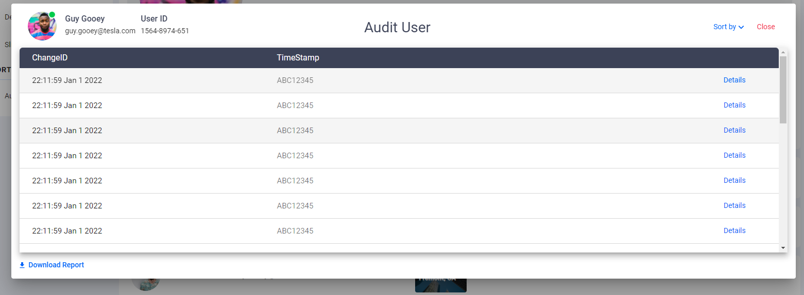
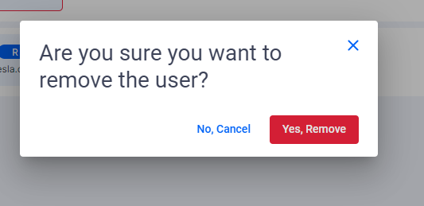
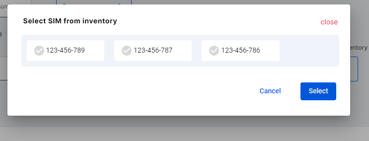
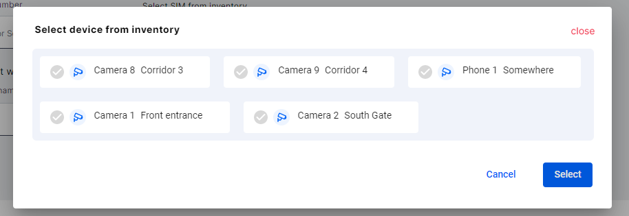
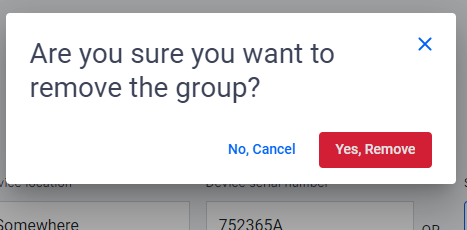
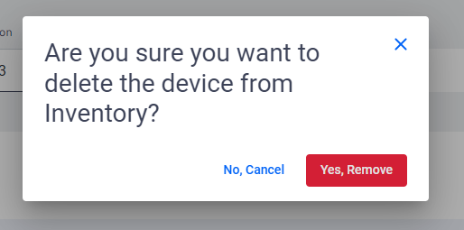
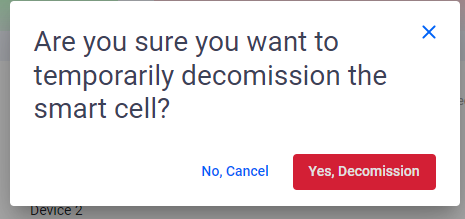
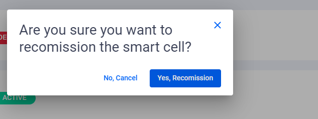
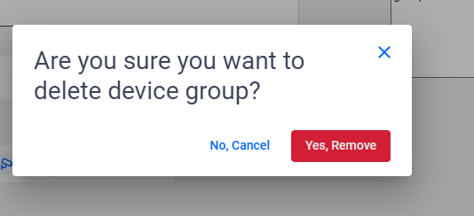

<!--
SPDX-FileCopyrightText: 2020-present Open Networking Foundation <info@opennetworking.org>

SPDX-License-Identifier: Apache-2.0
-->

# Dailog Components

Dialog compoents are used in general for action confirmations or for displaying information.

- In Aether portal we have in total 12 dialog components.
- The following images are the various Dialog components that are being used in the applciation.
- `Audit User`

  

- `Remove User`

  

- `Delete User`

  

- `Select SIM`

  

- `Select Device`

  

- `Delete Device / SIM`

  

- `Delete Device` from inventory

  

- `Delete Service`

  

- `Decommisson Small Cell`

  

- `Recomminsion Small Cell`

  

- `Delete Device Group`

  

- `Delete Slice`

  

## Developer Information

### Implementation

**Dialog Components** are created using **MatDialog**:

- `Admin` panel contains three of the **Dialog** components:
  1. `Audit User` is the component used to display the latest activities performed by the respective user.
  1. `Remove User` is used to remove the user from any site in the Admin Screen available in the controls.
  1. Once the user accepts to remove the user will be removed from the list of users of the respective site.
  1. `Delete User` is used to delete the user from the organization.
  1. Once the user confirms the action the selected user will be deleted.
  1. All these actions are now static and are directly removed from the arrays.
- `Device/SIM` section has the following **Dialogs**:
  1. While creating a new **Device / SIM** connection, the user has the option to select the SIM or Devices from a list of available SIMs or Devices from the inventory.
  1. A dialog is opened displaying the available options, user will be selecting the required option and has to click on OK.
  1. Once the user selects an option the respective data will be upated.
  1. While editing the a **Device / SIM** connection, user has the option to delete the connection.
  1. After user confirms the action respective **Device** and **SIM** will be added to the inventory.
  1. Users are also provided with the option to delete devices from the inventory.
  1. As the user confirms it the device will be removed from the inventory.
- `Services` has a dialog to delete a service, this is also a confirmation dialog where once the user accepts the service will be deleted.
- `Small Cells` have the following **Dialogs**:
  1. User can temporarily or permanently **Decomission** a small cell.
  1. Same dialog is used for both the temporary and permanent decomission.
  1. By passing the type parameter different texts are dispalyed for the user.
  1. A decomissioned small cell can also be recomissioned.
  1. **Recomission** has also a confirmation dialog where upon user acceptance a decomissioned small cell will be recomissioned.
- `Device Groups` and `Slices` also dialogs to confirmation on delete. Where the simialr process will be followed as explained for the above components.
