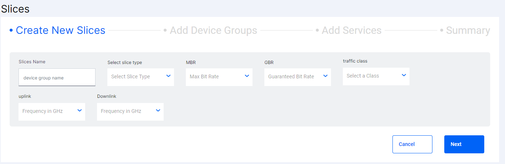
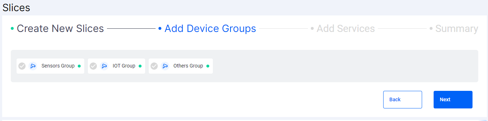
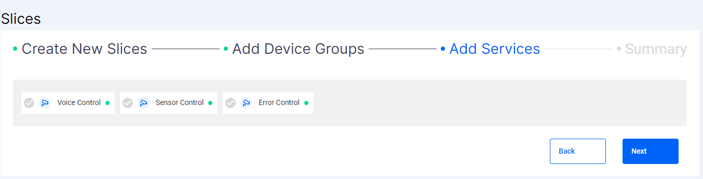
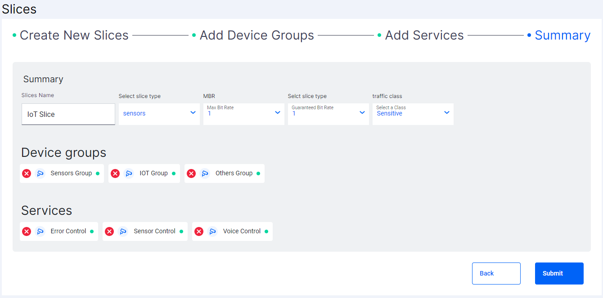
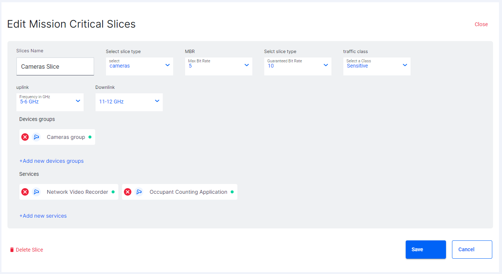

# Slice Component

Slices component is used to display the Slices.

- Each slice has multiple [`Device Groups`](../device-groups/README.md) and the [Services](../services/README.md) (applications) they can access.
- Creating a slice is a multi step process.
- In the first step the basic slice details are provided.

  

- In the second step users can select the available device groups that they want to add to the slice.

  

- In the third step users can select the available services that they want to add to the slice.

  

- Then there is a summary screen available to finalize the options that are selected before creating the slice.

  

- Existing Slice details can be edited using the edit option.

  

- While editing users will be provided the option to delete the slice which on confirmation will be deleted.
- On clicking of delete button a popup will be triggered that will open [Delete Dialog](../dialogs/README.md)

## Developer Information

### Implementation

When the **Slices Component** is loaded:

- A function is called to set the current Site.
- A REST-API request is sent as a GET to [https://chronos-dev.onlab.us/chronos-exporter/config](https://chronos-dev.onlab.us/chronos-exporter/config).
- This request returns the info of the slices available for the site.
- Mat Select is used for the dropdowns in the edit and add services view.
- As the API is only available for fetching the data. The fetched slices are added into the array.
- All the CRUD operations that are performed after the initial fetch are handled in the frontend.
- Using Array methods like push, splice etc these CRUD operations are performed.
