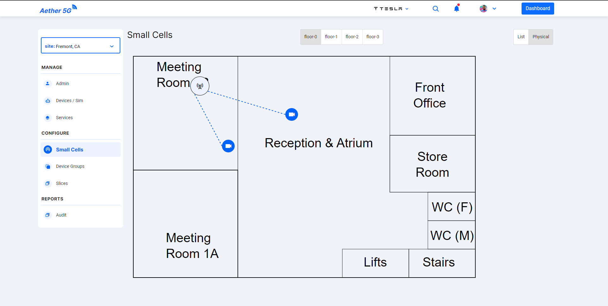
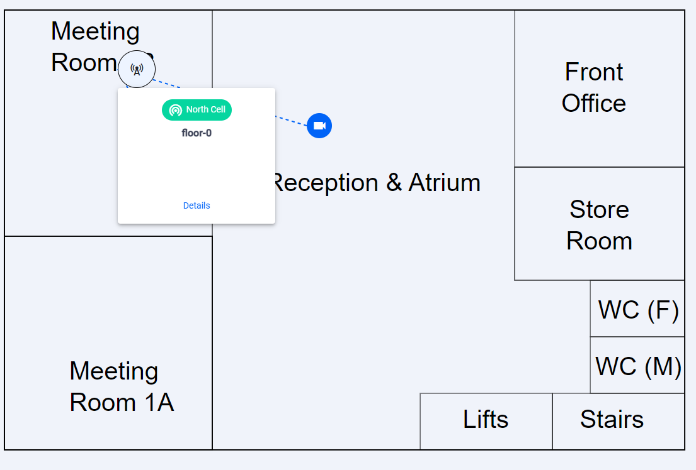
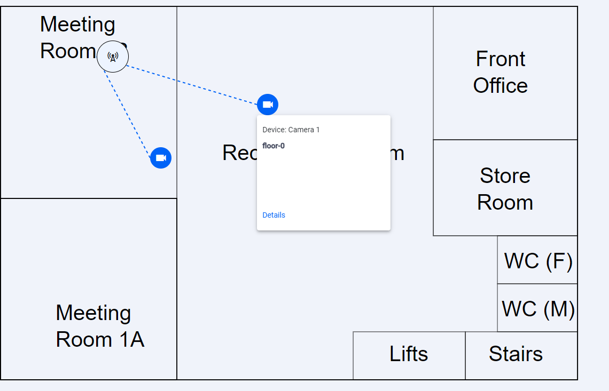
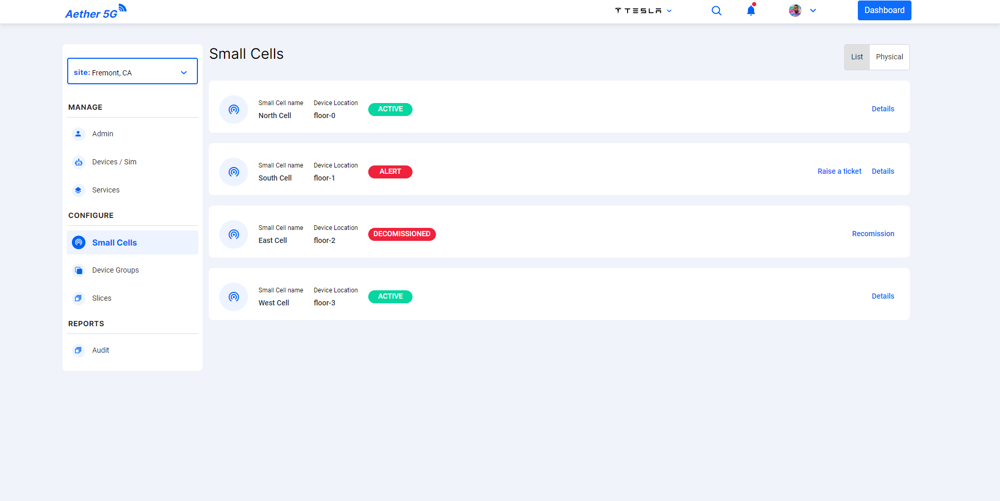
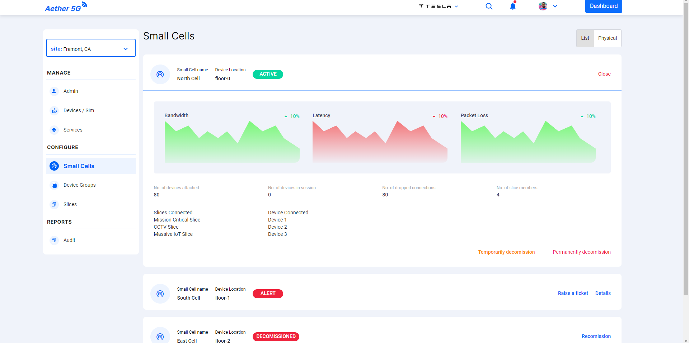

<!--
SPDX-FileCopyrightText: 2020-present Open Networking Foundation <info@opennetworking.org>

SPDX-License-Identifier: Apache-2.0
-->

# Small Cell Component

- Small Cells is used to access the information of the small cells and the devices connected to the respective small cell.
- The regions available in the Site.
- List and Physical View of the Small Cell.

- In Physical View `Small Cells` are shown in each region available in the sites.
- Using the options in the top of the panel users can switch between regions.
- By Clicking on the `Small cells` and `Devices` icons users can we information about them in a small pop up.

  

  

- In List View a list of `Small Cells` is diaplayed with the status.

  

- In the `Details` view, a detailed view of the small cell is displayed with options to `Decimission` (Temporarily or Permanently).

  

- The decomissioned `Small Cells` can be remossioned

## Developer Information

### Implementation

When **Small Cells** are loaded:

- A function is called to set the current Site.
- A REST-API request is sent as a GET to [https://chronos-dev.onlab.us/chronos-exporter/config](https://chronos-dev.onlab.us/chronos-exporter/config).
- This request returns the info of the small cells and the regions available for the site.
- A flag is used switch between **List** and **Physical View**.
- Mat Menu is used for displaying the info of **Small Cells** and **Devices**.
- Mat Dialogs are used as the pop ups for confirmation actions like **Decomission** and **Decomission**.
