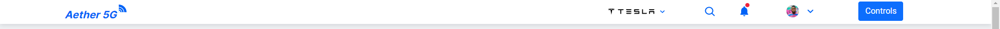
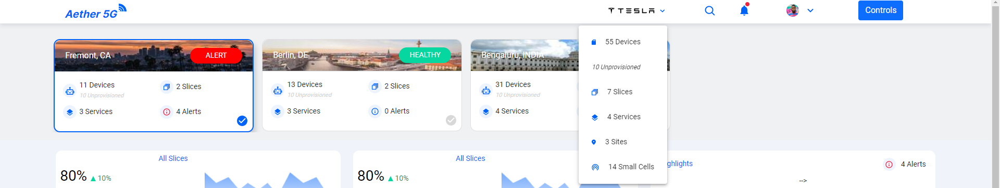
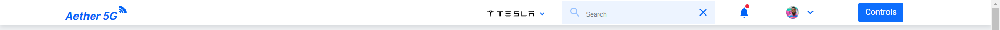
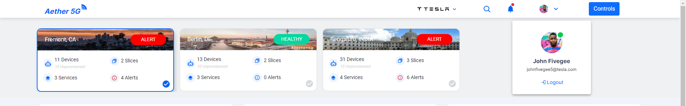

<!--
SPDX-FileCopyrightText: 2020-present Open Networking Foundation <info@opennetworking.org>

SPDX-License-Identifier: Apache-2.0
-->

# Header Component

Header is available at the top of the screen and is useful in accessing multiple features in the application with quick actions.

- `Aether logo` in the header is used to redirect to the dashboard from any point of the application.
- Aether logo is followed by the Client's (Company's) name and the information regarding the company is shown here.

  

- The search option is available to search for the options available in the application.

  

- The `Bell icon` is to show the notifications across the sites available for the company.
- The user profile picture holds the user information and an option to logout from the application.

  

- The `Controls` is used to navigate across various functionalities available in the application.

  

## Developer Information

### Implementation

When the **Header** is loaded:

- A REST-API request is sent as a GET to [https://chronos-dev.onlab.us/chronos-exporter/config](https://chronos-dev.onlab.us/chronos-exporter/config).
- This request returns the information about the company.
- The navigation across the application is achieved using Angular router techniques like **routerLink** and **router**.
