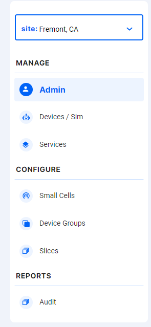

# Navbar Component

Navbar is available in the controls section of the application. It is useful in navigating between various functionalities in the controls.

- User can change the site in the top section of the Navbar.

  

- Clicking on `Admin` will navigate to the Admin screen. In Admin screen we can manage the users in the application.
- Clicking on `Devices / SIM` will navigate to the devices. All the services (applications) handled.
- Clicking on `Small Cells` will navigate to the small cells.
- Clicing on `Device Groups` will navigate to the Device groups.
- Clicking on `Slices` will navigate to the Slices.

## Developer Information

### Implementation

When the **Navbar** is loaded:

- A REST-API request is sent as a GET to [https://chronos-dev.onlab.us/chronos-exporter/config](https://chronos-dev.onlab.us/chronos-exporter/config).
- This request returns the list of sites.
- The navigation across the application is achieved using Angular router techniques like **routerLink** and **router**.
- Respective section is highlighted based on the link loaded using CSS.
